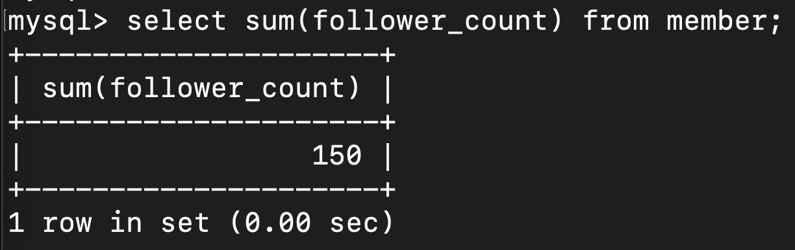
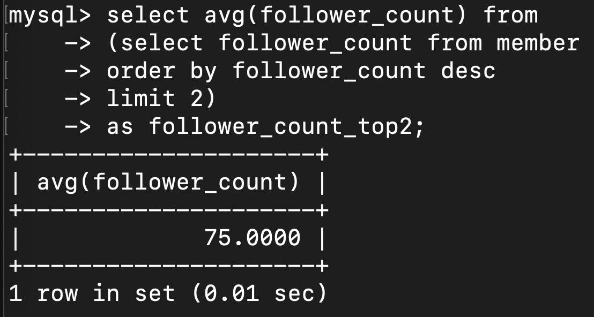

## Task 2

1. create database website;
2. use website;  
   create table member (  
   -> id bigint PRIMARY KEY AUTO_INCREMENT COMMENT "Unique ID",  
   -> name varchar(255) NOT NULL COMMENT "Name",  
   -> username varchar(255) NOT NULL COMMENT "Username",  
   -> password varchar(255) NOT NULL COMMENT "Password",  
   -> follower_count INT UNSIGNED NOT NULL DEFAULT 0 COMMENT "Follower Count",  
   -> time datetime NOT NULL DEFAULT CURRENT_TIMESTAMP COMMENT"Signup Time");

## Task 3

1. insert into member (name, username, password)  
   -> values ("test", "test", "test"),  
   -> ("Hello World", "helloworld", "hihihi"),  
   -> ("Steve Bob", "steve123", "456789"),  
   -> ("Jennie Yang", "yangyang", "qazxsw"),  
   -> ("Han Soo Yuan", "syhan", "poiuytrewq");
2. select \* from member;
3. select \* from member order by time desc;
4. select \* from member order by time desc limit 3 offset 1;
5. select \* from member where username = "test";
6. select \* from member where name like "%es%";
7. select \* from member where username = "test" and password = "test";
8. update member set name = "test2" where username = "test";

## Task 4

1. select count(\*) from member;
2. select sum(follower_count) from member;
3. select avg(follower_count) from member;
4. select avg(follower_count) from member order by follower_count desc limit 2 offset 0;

## Task 5

1. create table message (  
   id bigint PRIMARY KEY AUTO_INCREMENT COMMENT "Unique ID",  
   member_id bigint NOT NULL COMMENT "Member ID for Message Sender",  
   content varchar(255) NOT NULL COMMENT "Content",  
   like_count INT UNSIGNED NOT NULL DEFAULT 0 COMMENT "Like Count",  
   time datetime NOT NULL DEFAULT CURRENT_TIMESTAMP COMMENT "Publish Time",  
   FOREIGN KEY (member_id) REFERENCES member(id));
2. select message.id, message.content, member.name from message join member on message.member_id = member.id;
3. select message.id, message.content, member.name from message join member on message.member_id = member.id  
   -> where member.username = "test";
4. select avg(like_count) from message  
   -> join member on message.member_id = member.id  
   -> where member.username = "test";
5. select avg(like_count), member.username  
   -> from message  
   -> join member on message.member_id = member.id  
   -> group by member.username;

